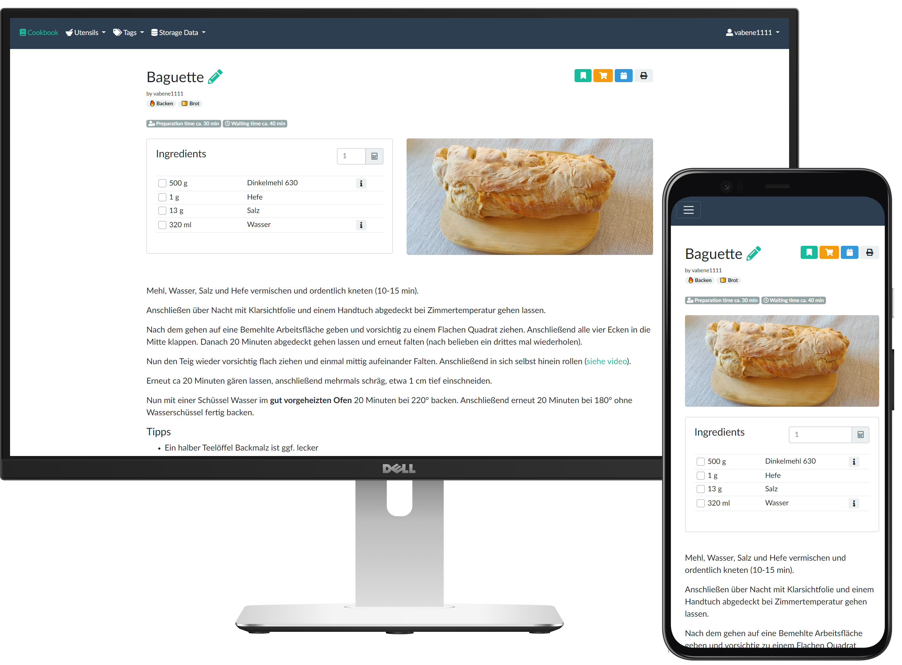

<h1 align="center">
   
  
   
  Tandoor Recipes
   
</h1>

<h4 align="center">The recipe manager that allows you to manage your ever growing collection of digital recipes.</h4>

<a href="https://tandoor.dev" target="_blank" rel="noopener noreferrer">Website</a> •
<a href="https://docs.tandoor.dev/install/docker/" target="_blank" rel="noopener noreferrer">Installation</a> •
<a href="https://docs.tandoor.dev/" target="_blank" rel="noopener noreferrer">Docs</a> •
<a href="https://app.tandoor.dev/accounts/login/?demo" target="_blank" rel="noopener noreferrer">Demo</a> •
<a href="https://discord.gg/RhzBrfWgtp" target="_blank" rel="noopener noreferrer">Discord</a>

## Core Features
- 🥗 **Manage your recipes** - Manage your ever growing recipe collection
- 📆 **Plan** - multiple meals for each day
- 🛒 **Shopping lists** - via the meal plan or straight from recipes
- 📚 **Cookbooks** - collect recipes into books
- 👪 **Share and collaborate** on recipes with friends and family

## Made by and for power users

- 🔍 Powerful & customizable **search** with fulltext support and [TrigramSimilarity](https://docs.djangoproject.com/en/3.0/ref/contrib/postgres/search/#trigram-similarity)
- 🏷️ Create and search for **tags**, assign them in batch to all files matching certain filters
- ↔️ Quickly merge and rename ingredients, tags and units
- 📥️ **Import recipes** from thousands of websites supporting [ld+json or microdata](https://schema.org/Recipe)
- ➗ Support for **fractions** or decimals
- 🐳 Easy setup with **Docker** and included examples for **Kubernetes**, **Unraid** and **Synology**
- 🎨 Customize your interface with **themes**
- 📦 **Sync** files with Dropbox and Nextcloud

## All the must haves

- 📱Optimized for use on **mobile** devices
- 🌍 localized in many languages thanks to the awesome community
- 📥️ **Import your collection** from many other [recipe managers](https://docs.tandoor.dev/features/import_export/)
- ➕ Many more like recipe scaling, image compression, printing views and supermarkets

This application is meant for people with a collection of recipes they want to share with family and friends or simply
store them in a nicely organized way. A basic permission system exists but this application is not meant to be run as
a public page.

## Docs

Documentation can be found [here](https://docs.tandoor.dev/).

## Support our work
Tandoor is developed by volunteers in their free time just because its fun. That said earning
some money with the project allows us to spend more time on it and thus make improvements we otherwise couldn't.
Because of that there are several ways you can support us

- **GitHub Sponsors** You can sponsor contributors of this project on GitHub: [vabene1111](https://github.com/sponsors/vabene1111)
- **Host at Hetzner** We have been very happy customers of Hetzner for multiple years for all of our projects. If you want to get into self-hosting or are tired of the expensive big providers, their cloud servers are a great place to get started. When you sign up via our [referral link](https://hetzner.cloud/?ref=ISdlrLmr9kGj) you will get 20€ worth of cloud credits and we get a small kickback too.
- **Let us host for you** We are offering a [hosted version](https://app.tandoor.dev) where all profits support us and the development of tandoor (currently only available in germany).

## Contributing
Contributions are welcome but please read [this](https://docs.tandoor.dev/contribute/guidelines/) **BEFORE** contributing anything!

## Your Feedback

Share some information on how you use Tandoor to help me improve the application [Google Survey](https://forms.gle/qNfLK2tWTeWHe9Qd7)

## Get in touch

<table>
  <tr>
    <td><a href="https://discord.gg/RhzBrfWgtp">Discord</a></td>
    <td>We have a public Discord server that anyone can join. This is where all our developers and contributors hang out and where we make announcements</td>
  </tr>

  <tr>
    <td><a href="https://twitter.com/TandoorRecipes">Twitter</a></td>
    <td>You can follow our Twitter account to get updates on new features or releases</td>
  </tr>
</table>

## License

Beginning with version 0.10.0 the code in this repository is licensed under the [GNU AGPL v3](https://www.gnu.org/licenses/agpl-3.0.de.html) license with a
[common clause](https://commonsclause.com/) selling exception. See [LICENSE.md](https://github.com/vabene1111/recipes/blob/develop/LICENSE.md) for details.

> NOTE: There appears to be a whole range of legal issues with licensing anything other than the standard completely open licenses.
> I am in the process of getting some professional legal advice to sort out these issues. 
> Please also see [Issue 238](https://github.com/vabene1111/recipes/issues/238) for some discussion and **reasoning** regarding the topic.

**Reasoning**
**This software and *all* its features are and will always be free for everyone to use and enjoy.**

The reason for the selling exception is that a significant amount of time was spend over multiple years to develop this software.
A paid hosted version which will be identical in features and code base to the software offered in this repository will
likely be released in the future (including all features needed to sell a hosted version as they might also be useful for personal use).
This will not only benefit me personally but also everyone who self-hosts this software as any profits made through selling the hosted option
allow me to spend more time developing and improving the software for everyone. Selling exceptions are [approved by Richard Stallman](http://www.gnu.org/philosophy/selling-exceptions.en.html) and the
common clause license is very permissive (see the [FAQ](https://commonsclause.com/)).
