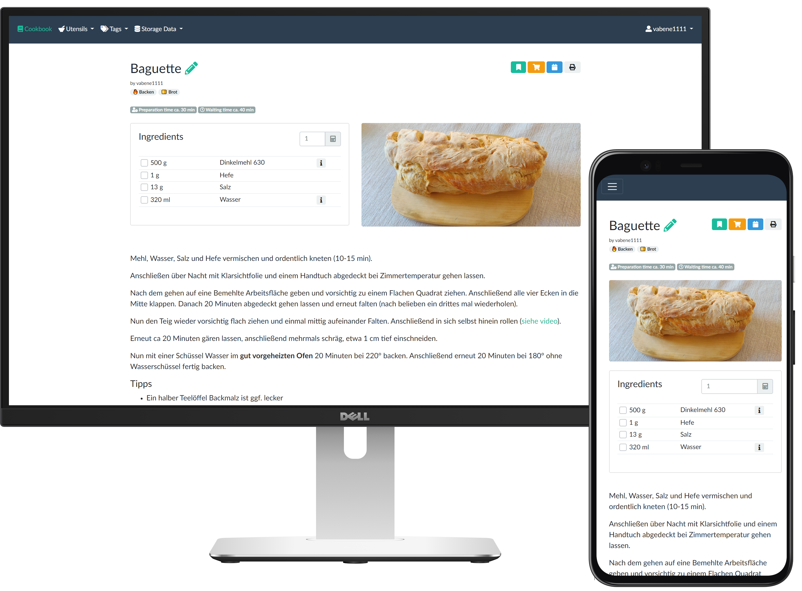

<h1 align="center">
   
  
   
  Tandoor Recipes (Wersja Domowa)
   
</h1>

<h4 align="center">Menedżer posiłków, który pozwala zapanować nad Twoją rosnącą kolekcją cyfrowych przepisów.</h4>

  <strong>To jest prywatny "fork" niesamowitego projektu Tandoor Recipes.</strong> 
  Oryginalny kod, pełna dokumentacja oraz wsparcie autorów znajdują się w głównym repozytorium: 
  <a href="https://github.com/vabene1111/recipes">vabene1111/recipes</a>.

<a href="https://tandoor.dev" target="_blank">Strona Projektu</a> •
<a href="https://docs.tandoor.dev/install/docker/" target="_blank">Instalacja (Oryginalna)</a> •
<a href="https://docs.tandoor.dev/" target="_blank">Dokumentacja</a> •
<a href="https://app.tandoor.dev/e/demo-auto-login/" target="_blank">Demo</a> •
<a href="https://community.tandoor.dev" target="_blank">Społeczność</a>

## 🥗 Główne Funkcje

* **Zarządzanie przepisami** – Szybki i intuicyjny edytor Twojej kolekcji.
* **Planowanie posiłków** – Planuj wiele dań na każdy dzień.
* **Listy zakupów** – Tworzone automatycznie z planu posiłków lub wybranych przepisów.
* **Wsparcie AI** – Wykorzystaj sztuczną inteligencję do rozpoznawania zdjęć przepisów, sortowania kroków i wyliczania wartości odżywczych.
* **Książki kucharskie** – Zbieraj przepisy w tematyczne tomy.
* **Współpraca** – Dziel się przepisami i gotuj wspólnie z rodziną i przyjaciółmi.

## 📱 Tandoor na telefonie (PWA)

Tandoor nie wymaga pobierania ze sklepów z aplikacjami. Możesz go zainstalować jako "Progressive Web App", co pozwala na szybki dostęp i pracę offline.

### Jak zainstalować?
* **iPhone/iPad (Safari):** Otwórz naszą stronę Tandoor, kliknij ikonę udostępniania (kwadrat ze strzałką) i wybierz **"Dodaj do ekranu początkowego"**.
* **Android (Chrome):** Otwórz stronę, poczekaj na komunikat "Dodaj Tandoor do ekranu głównego" lub wybierz tę opcję z menu (trzy kropki).

## 🛠️ Funkcje dla zaawansowanych

* 🔍 **Potężna wyszukiwarka** z pełnotekstową obsługą i filtrowaniem.
* 🏷️ **Tagi i składniki** – Masowe edytowanie, scalanie i porządkowanie bazy.
* 📥 **Importowanie przepisów** – Wklej link z niemal dowolnej strony kulinarnej, a Tandoor sam wyciągnie treść.
* ➗ **Skalowanie** – Automatyczne przeliczanie ilości składników na inną liczbę porcji.
* 🎨 **Motywy** – Możliwość pełnej personalizacji wyglądu (w tym tryb ciemny).

---

## ❤️ Wesprzyj twórców oryginału ❤️

Tandoor jest tworzony przez wolontariuszy w ich wolnym czasie. Jeśli aplikacja ułatwia Ci życie, rozważ wsparcie głównego autora projektu:

- **GitHub Sponsors:** [vabene1111](https://github.com/sponsors/vabene1111)
- **Patreon:** [vabene1111](https://www.patreon.com/cw/vabene1111)
- **Hetzner Referral:** Jeśli planujesz własny serwer, skorzystaj z tego [linku polecającego](https://hetzner.cloud/?ref=ISdlrLmr9kGj), aby otrzymać 20€ bonusu i wesprzeć projekt.

---

## 🤝 Kontakt i pomoc

Wszelkie sugestie zmian, prośby o nowe funkcje lub zgłoszenia problemów technicznych z *naszą* instancją prosimy kierować do zakładki **Discussions** w tym repozytorium.

## Licencja

Kod źródłowy jest udostępniany na licencji [GNU AGPL v3](https://www.gnu.org/licenses/agpl-3.0.de.html). Szczegóły znajdziesz w pliku [LICENSE.md](https://github.com/vabene1111/recipes/blob/develop/LICENSE.md).