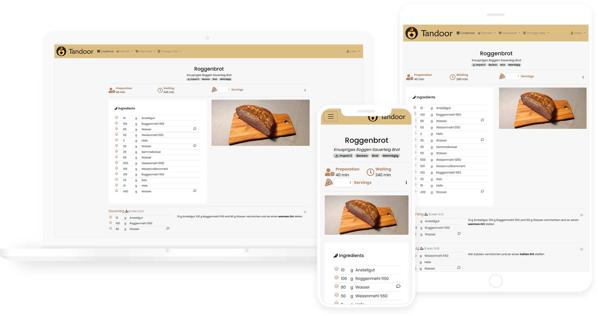

# Recipes 
 

Recipes is a Django application to manage, tag and search recipes using either built-in models or 
external storage providers hosting PDF's, images or other files.

[Installation Instructions](https://vabene1111.github.io/recipes/install/docker/) - [Documentation](https://vabene1111.github.io/recipes/) - [More (slightly outdated) Screenshots](https://imgur.com/a/V01151p)

## Features

- 📦 **Sync** files with Dropbox and Nextcloud (more can easily be added)
- 🔍 Powerful **search** with Djangos [TrigramSimilarity](https://docs.djangoproject.com/en/3.0/ref/contrib/postgres/search/#trigram-similarity)
- 🏷️ Create and search for **tags**, assign them in batch to all files matching certain filters
- 📄 **Create recipes** locally within a nice, standardized web interface
- ⬇️ **Import recipes** from thousands of websites supporting [ld+json or microdata](https://schema.org/Recipe)
- 📱 Optimized for use on **mobile** devices like phones and tablets
- 🛒 Generate **shopping** lists from recipes
- 📆 Create a **Plan** on what to eat when
- 👪 **Share** recipes with friends and comment on them to suggest or remember changes you made
- ➗ automatically convert decimal units to **fractions** for those who like this
- 🐳 Easy setup with **Docker** and included examples for Kubernetes, Unraid and Synology
- 🎨 Customize your interface with **themes**
- ✉️ Export and import recipes from other users
- 🌍 localized in many languages thanks to the awesome community
- ➕ Many more like recipe scaling, image compression, cookbooks, printing views, ...

This application is meant for people with a collection of recipes they want to share with family and friends or simply
store them in a nicely organized way. A basic permission system exists but this application is not meant to be run as 
a public page.
Documentation can be found [here](https://github.com/vabene1111/recipes/wiki).

While this application has been around for a while and is actively used by many (including myself), it is still considered
**beta** software that has a lot of rough edges and unpolished parts.

## Documentation
Please refer to the [documentation](https://vabene1111.github.io/recipes/) for everything you need to know.

## License

Beginning with version 0.10.0 the code in this repository is licensed under the [GNU AGPL v3](https://www.gnu.org/licenses/agpl-3.0.de.html) license with an
[common clause](https://commonsclause.com/) selling exception. See [LICENSE.md](https://github.com/vabene1111/recipes/blob/develop/LICENSE.md) for details.

> NOTE: There appears to be a whole range of legal issues with licensing anything else then the standard completely open licenses.
> I am in the process of getting some professional legal advice to sort out these issues. 
> Please also see [Issue 238](https://github.com/vabene1111/recipes/issues/238) for some discussion and **reasoning** regarding the topic.

**Reasoning**  
**This software and *all* its features are and will always be free for everyone to use and enjoy.**

The reason for the selling exception is that a significant amount of time was spend over multiple years to develop this software.
A payed hosted version which will be identical in features and code base to the software offered in this repository will
likely be released in the future (including all features needed to sell a hosted version as they might also be useful for personal use).
This will not only benefit me personally but also everyone who self-hosts this software as any profits made trough selling the hosted option
allow me to spend more time developing and improving the software for everyone. Selling exceptions are [approved by Richard Stallman](http://www.gnu.org/philosophy/selling-exceptions.en.html) and the
common clause license is very permissive (see the [FAQ](https://commonsclause.com/)).
