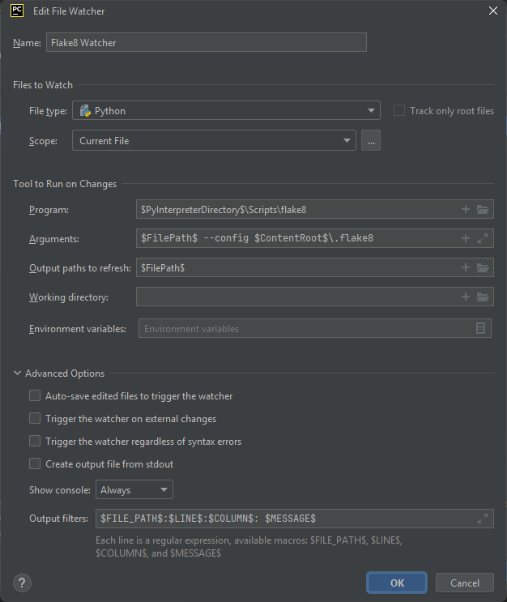
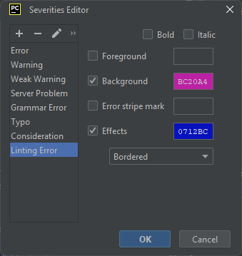
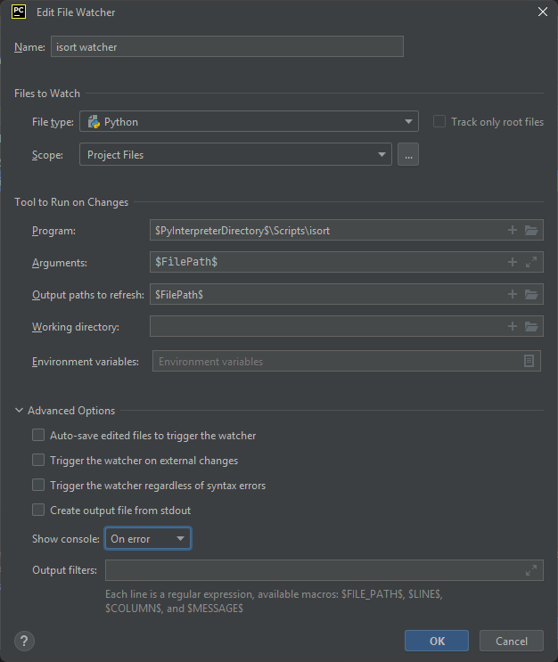
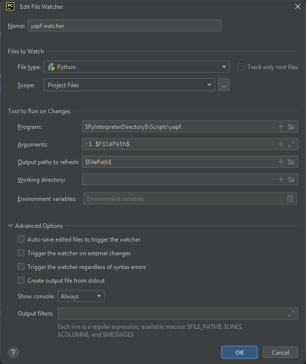
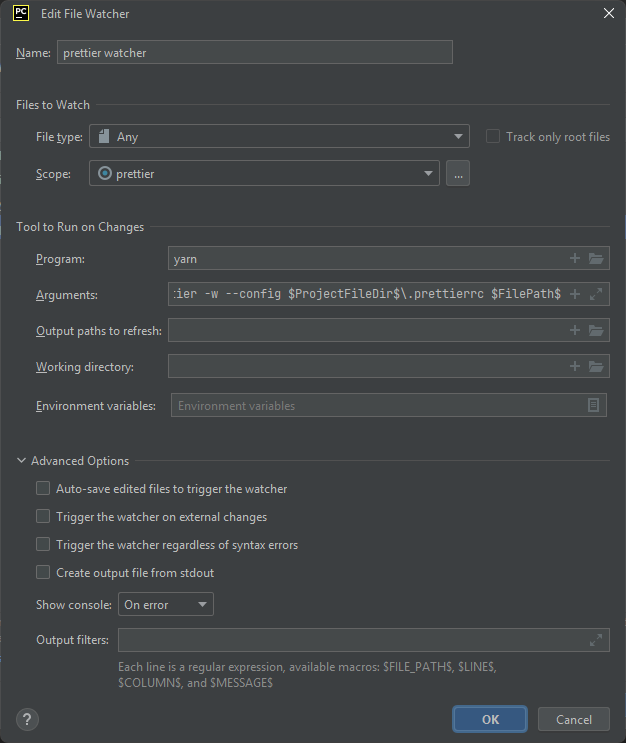

PyCharm can be configured to format and lint on save. Doing so requires some manual configuration as outlined below.

## Setup File Watchers

1. Navigate to File -> Settings -> Plugins
2. Download and install [File Watchers](https://plugins.jetbrains.com/plugin/7177-file-watchers)
3. Navigate to File -> Settings -> Tools -> Black
4. Confirm 'Use Black Formatter' is unchecked for both 'On code reformat' and 'On save'

## Setup flake8 Watcher

1. Navigate to File -> Settings -> Tools -> File Watchers
2. Click the '+' to add a new watcher.
3. Configure the watcher as below.

    

4. Navigate to File -> Settings -> Editor -> Inspections -> File watcher problems
5. Under Severity select 'Edit Severities'
6. Click the '+' to add a severity calling it 'Linting Error'
7. Configure a background and effect as below.

    

## Setup isort

1. Navigate to File -> Settings -> Tools -> File Watchers
2. Click the '+' to add a new watcher.
3. Configure the watcher as below.

    

## Setup yapf

1. Navigate to File -> Settings -> Tools -> File Watchers
2. Click the '+' to add a new watcher.
3. Configure the watcher as below.

    

<!-- prettier-ignore -->
!!! hint
    Adding a comma at the end of a list will trigger yapf to put each element of the list on a new line

## Setup prettier

1. Navigate to File -> Settings -> Tools -> File Watchers
2. Click the '+' to add a new watcher.
3. Change 'File Type' to 'Any'.
4. Click the three dots next to 'Scope' to create a custom scope.
5. Click '+' to add a new scope

-   Name: prettier
-   Pattern: `file:vue/src//*||file:vue3/src//*||file:docs//*`

6. Configure the watcher as below.

    

-   Arguments: `--cwd $ProjectFileDir$\vue prettier -w --config $ProjectFileDir$\.prettierrc $FilePath$`

## Setup Volar??
